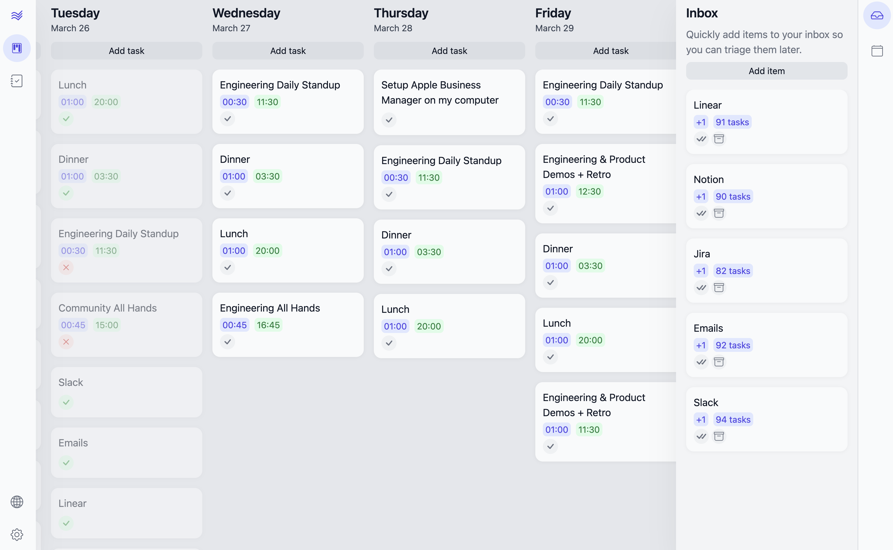

Flow is a daily planner that helps you plan your days. Flow is designed to help you get things done and stay organized. It is plugin-based and highly customizable, so you can tailor it to your needs.

## Features

- 📊 Daily planner as a Kanban board: plan your day by adding tasks, events, and notes to your day.
- 🧾 External items: simply  drag items like Linear issues into your day.
- 📕 Routines: go through specific routines or rituals throughout your day to help you stay focused and productive. You can even use Routines to remind you to take breaks or go through a gym workout.
- 🧩 Plugin-based: Flow is designed to be extensible. You can add new features by installing plugins. Anything from an integration with your favorite service, like Linear, adding a new theme to your Flow, to adding a new view to the app.
- ⚙️ Customizable: Flow's basic features, like Routines, are highly customizable. You can change the steps in a Routine to fit your needs.
- 💯 Open source: Flow is open source, so you can contribute to it and know exactly how your data is used.

## Plugins

Flow is designed to be extensible. You can add new features by installing plugins. Anything from an integration with your favorite service, like Linear, adding a new theme to your Flow, to adding a new view to the app.

You can find plugins in the by clicking on the 🌎 (world) icon in your Flow.

If you are looking for an integration with your favorite service, but it's not there, [create an issue in the repo](https://github.com/richardguerre/flow/issues/new) and it'll be prioritized accordingly (it usually takes a week to create a simple integration with a service).
